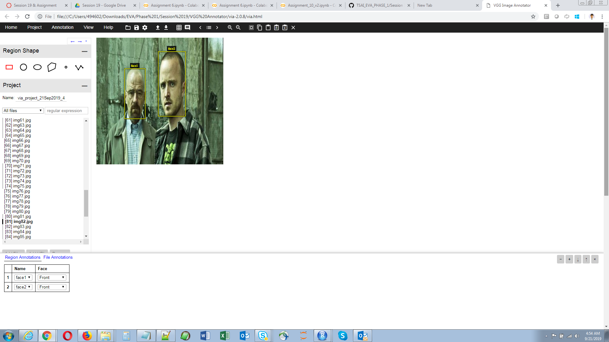
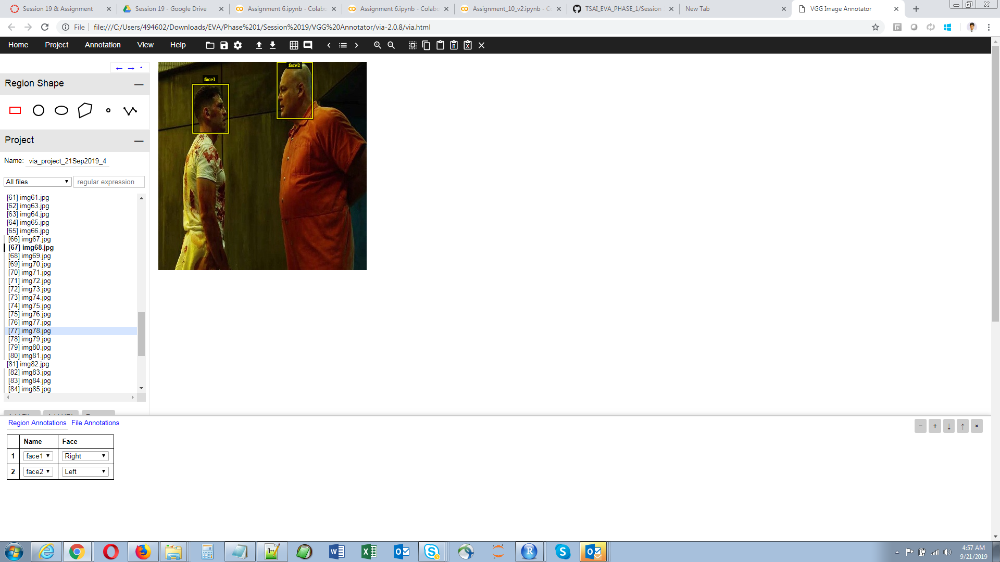
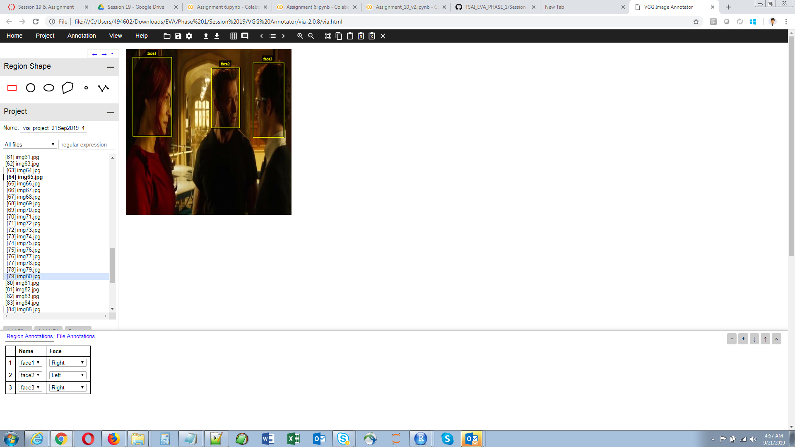
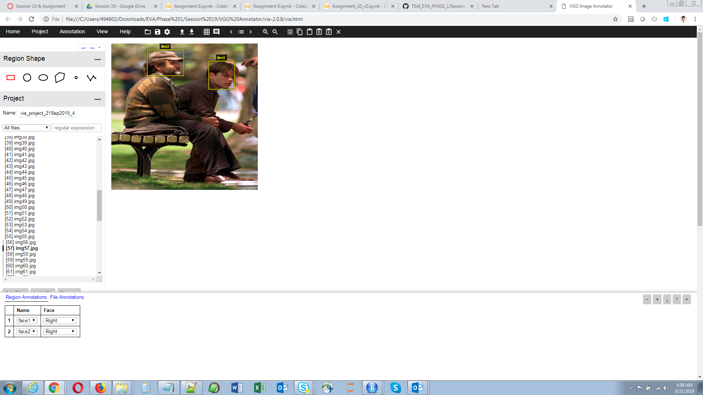
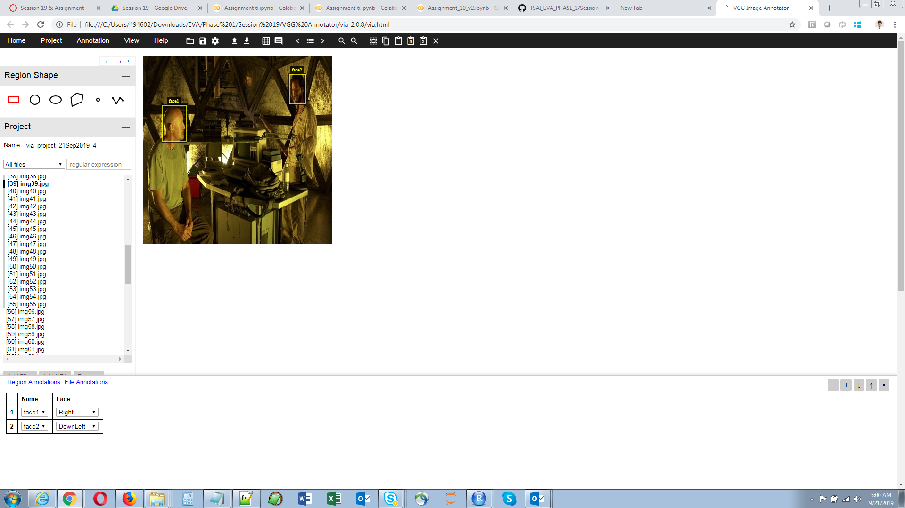

### Please find the below images as a proof of completion of annotation:

### Also, as mentioned in Clustering coding file centroid of all 4 clusters are:
### (151.8166666666667 , 75.45),       (56.47142857142853 , 34.07142857142853), (208.69565217391303 , 118.43478260869563), (97.25287356321839 , 55.298850574712645)
